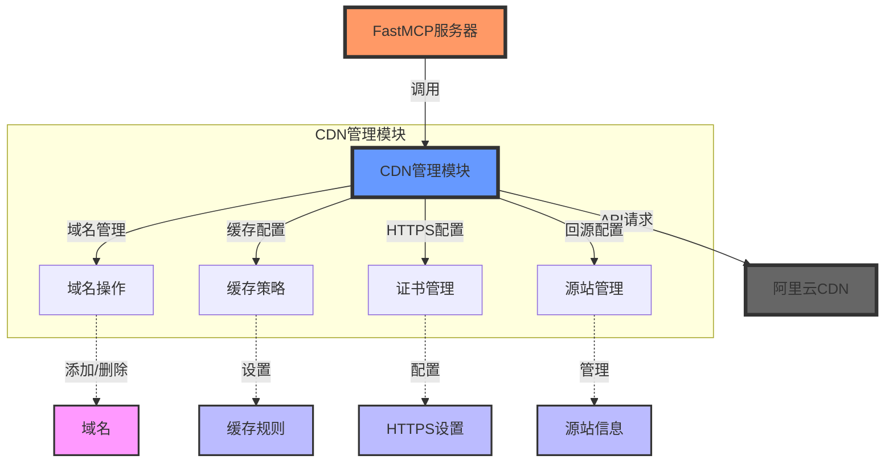
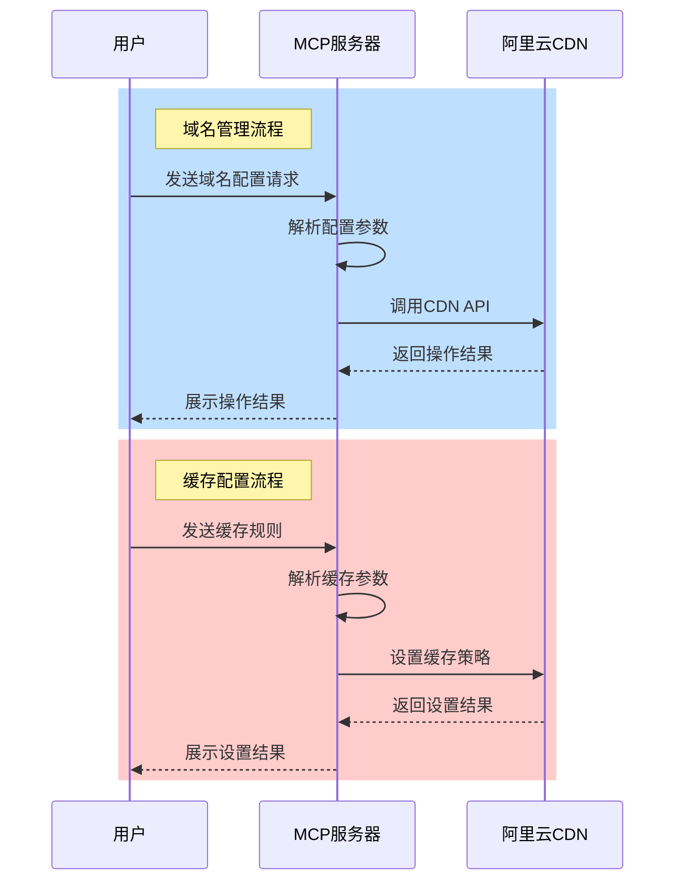
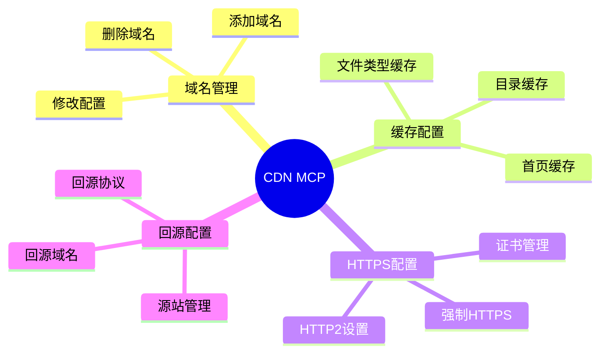

# Aliyun CDN MCP (Management Control Panel)

基于FastMCP框架开发的阿里云CDN管理控制面板，提供简单直观的CDN配置和管理功能。

## 项目架构



## 功能时序图



## 组件关系图



## 快速开始

### 环境要求
- Python 3.7+
- FastMCP框架
- 阿里云账号及AccessKey

### 安装依赖
```bash
pip install alibabacloud_cdn20180510
pip install fastmcp
```

### 配置环境变量
```bash
export ALIBABA_CLOUD_ACCESS_KEY_ID=your_access_key_id
export ALIBABA_CLOUD_ACCESS_KEY_SECRET=your_access_key_secret
```

## 使用方法

### 1. 基础域名配置
```python
{
  "params": {
    "domain_name": "example.com",
    "sources": "1.2.3.4:80",
    "cdn_type": "web"
  }
}
```

### 2. 自然语言配置
支持使用自然语言描述配置需求：
```text
帮我添加一个加速域名
加速类型为 大文件下载
mygslb04.xiangyuncdn.com
源站类型，ipaddr
源站的IP地址 211.131.56.91
回源端口 81
设置图片缓存1小时
```

### 3. 缓存规则配置
```python
{
  "params": {
    "domain_name": "example.com",
    "cache_rules": "*.jpg:3600"
  }
}
```

## 功能列表

1. 域名管理
   - 添加加速域名
   - 删除加速域名
   - 修改源站配置

2. 缓存配置
   - 设置文件类型缓存
   - 自定义缓存规则
   - 支持多种缓存时间单位

3. HTTPS配置
   - 配置SSL证书
   - 设置强制HTTPS跳转
   - 配置HTTP/2

4. 回源配置
   - 设置回源协议
   - 配置回源端口
   - 管理回源域名

## 错误处理

系统会自动处理常见错误并返回友好的错误信息：

- 域名格式错误
- API调用失败
- 参数验证失败
- 权限不足

## 贡献指南

1. Fork 本仓库
2. 创建新的功能分支
3. 提交您的更改
4. 创建 Pull Request

## 许可证

MIT License 